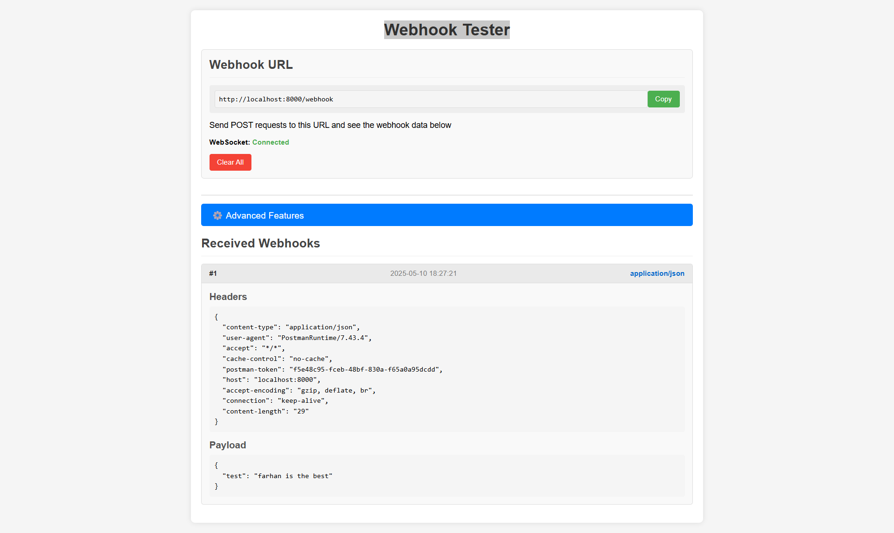
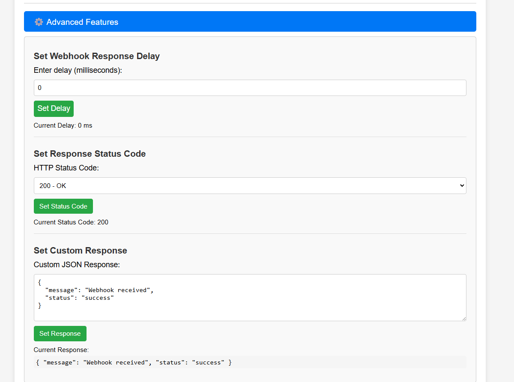

# Webhook tester FastAPI Application Setup Guide

This guide covers how to run my webhook testing  application directly on docker and also local environment.
## Option 1: Running with Docker

### Steps

1. **Build and start the application**

   ```bash
   docker-compose up --build
   ```

   This will:
   - Build the Docker image
   - Start a container with your FastAPI application
   - Mount your local code into the container for hot-reloading
   - Expose the application on port 8000

2. **Access your application**

   Open your browser and go to:
   ```
   http://localhost:8000
   ```

   These tools will give you a public URL that forwards to your local Docker container. if you are using port `8000` already change the port in docker-compose file.

3. **Stopping the application**

   Press `Ctrl+C` or run:
   ```bash
   docker-compose down
   ```


## Option 2: Running Directly (Without Docker)

### Prerequisites
- Python 3.11 or later
- pip (Python package manager)

### Steps

1. **Create a virtual environment**

   ```bash
   python -m venv venv
   
   # On Windows:
   venv\Scripts\activate
   
   # On macOS/Linux:
   source venv/bin/activate
   ```

2. **Install dependencies**

   ```bash
   pip install -r requirements.txt
   ```

3. **Run the application**

   ```bash
   uvicorn app.main:app --reload --host 0.0.0.0 --port 8000
   ```

4. **Access your application**

   Open your browser and go to:
   ```
   http://localhost:8000
   ```

## Webhook Testing Tips

### 1. Configure your webhook provider

test locally send post request to my url:
```
http://localhost:8000/webhook
```

### 2. what you can do with this application 

- As the name suggest you can test your webhooks
- Send 
  - custom response.
  - delayed response.
  - Send status code.
- response will be visible realtime since I am using web socket.



### Advance features include 

